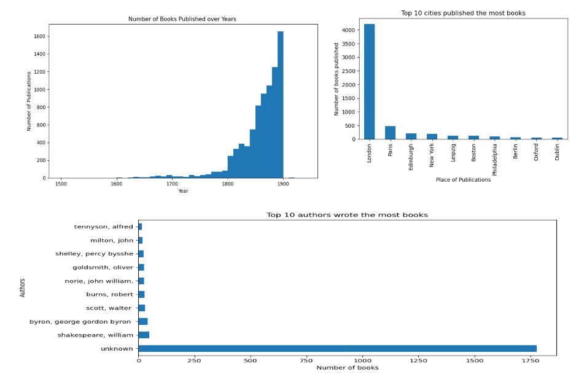

# Welcome to June's Portfolio of BI Analytics
## (*KEEP UPDATING*)
Three SQL databases went into a No SQL bar, but had to leave because they couldn't find any tables...

This is a repo for showcasing the school projects and other self-study pratices within Business Intelligence/data analytics for June.

# Power BI
## Project 1: Freddys-BI-cycle
* Help a bicycle company which has e-commerce and offline sales networks to set up automated reports using
PowerBI.
*	Identify the business requirements in Sales, Marketing, HR, CRM, Procurement and Finance and translate it to key metrics, design the DW structures and modeling with dimensions accordingly.  
* Extract data from different sources (server, flat files) and transform it to the form (modeling) ready for further analysis.
* Visualize key measures for storytelling for different department in forms of reports and dashboards.

## Project 2: Himalaya Supermarket
* Extract data from a supermarket's database to build a dashboard and Power BI automated report to track KPIs wthin areas of *sales, campaign performance, employee management and economic status*.

# SQL
## [Project 1: ETL and database modelling](https://github.com/skip2mylo/SQL/blob/20b1f2b316039c78eb71107d6762cd3117b8478c/Yijun%20Cao_Inl%C3%A4mningsuppgift%202%20ETL_updated.sql)
* Extracting data from different original data sources
* Design and create a new database using model star-schema
* Analyse sales, product inventory and production, employee management
* SQL scripts needs to be automated (update once a day)
* Consider how to optimize the database performance (indexing) 

## [Project 2: Personnummer control](https://github.com/skip2mylo/SQL/blob/20b1f2b316039c78eb71107d6762cd3117b8478c/Yijun%20Cao_Inl%C3%A4mnninsuppgift%201%20Kontrollsiffra.sql)
* To improve the ETL flow, generate a function to autentize Swedish personnummer

## [Other practices](https://github.com/skip2mylo/SQL/tree/main/other-practices)

# Python
## [Project 1: Order system](https://github.com/skip2mylo/python/blob/ecb5998a62632f9cd3f78d5d4a1a44c03d3f41ba/Order%20system.py)
* To simulate an order generating system by extracting order details from a database to combine with a random customer info generated by an API
* For user required customer account, create a funcontion to generate a csv file contains all the order histories automately

## [Project 2: Book collection statistics of British Library with Python](https://github.com/skip2mylo/python/blob/a1a9173adc37d66accc0cbff320652924f2a79f0/Data-cleansing/Books_Yijun%20Cao.py)
Using NumPy, Pandas libraries to cleanse the raw data (excel files) in the DataFrame (2% NaN value after the cleanse) to provide statistics related to authors and places of book publications. Visualize the findings with Matplotlib.

